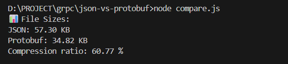

# JSON vs Protobuf Demo (Node.js)

This project demonstrates the efficiency of Protocol Buffers (Protobuf) compared to JSON.

It generates a sample dataset of users, saves it as both JSON and Protobuf binary files, and allows comparing their sizes to show how Protobuf reduces storage and improves performance.

